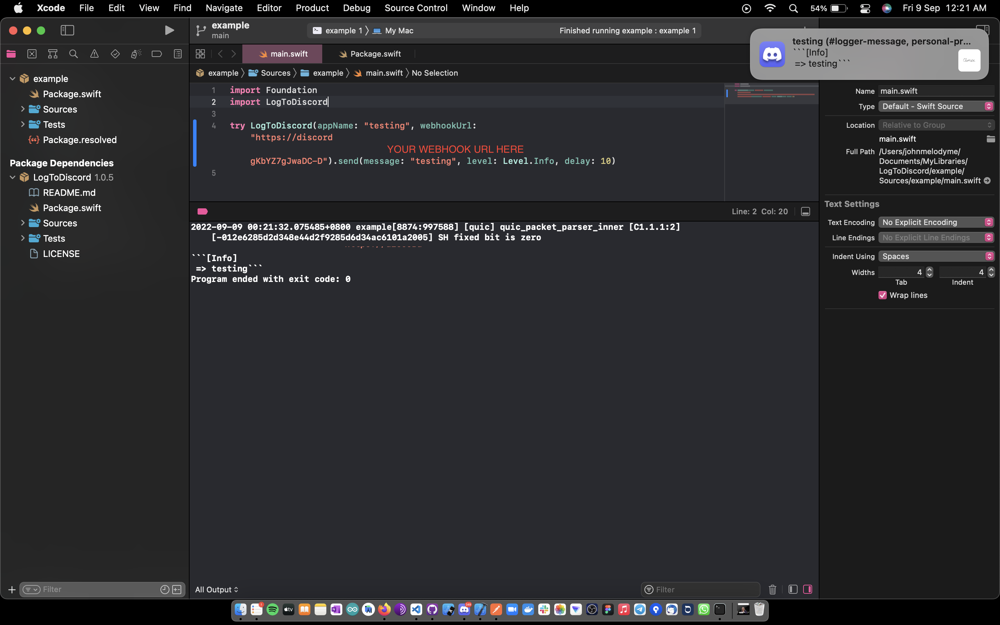
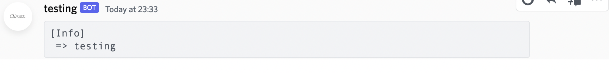

# LogToDiscord

这个包主要是为了方便地将消息发送到特定的Discord频道。是否来自服务器应用程序、IOS应用程序或MacOS应用程序。

### License

```
麻省理工学院许可证
版权所有（c）2023 钟智强
特此免费许可任何人获得副本
本软件和相关文档文件（“软件”），以处理
在软件中不受限制，包括但不限于权利
使用、复制、修改、合并、发布、分发、分许可和/或出售
软件的副本，并允许软件的使用者
根据以下条件提供：
上述版权声明和本许可声明应包含在
软件的副本或实质部分。
该软件是“按原样”提供的，没有任何形式的担保，明示或
隐含的，包括但不限于适销性保证，
适用于特定目的和不侵权。在任何情况下
作者或版权持有人应对任何索赔、损害或其他
因以下原因引起的责任，无论是在合同诉讼、侵权诉讼还是其他诉讼中，
因软件或在
软件。

```

### 安装
将以下行插入`Package.swift`

```
.package(url: "https://github.com/johnmelodyme/LogToDiscord.git", from: "1.0.5"),
```

### 用法:

```swift
import LogToDiscord

try LogToDiscord(
        appName: "testing",
        webhookUrl: "webhookUrl"
    ).send(message: "yourMessage", level: Level.Info, delay: 10)
```

### 说明：
参数“level”是发送给discord的消息的各个级别的枚举频道可用级别如下：

```swift
public enum Level
{
    case Error
    case Warn
    case Debug
    case Info
}
```

For demonstration please do refer to [example](https://github.com/johnmelodyme/LogToDiscord/blob/main/example/Sources/example/main.swift)

### 看起来怎么样:


</br>
</br>


</br>

#### 如果你真的喜欢我的作品,
<br />

